# Recipes Network

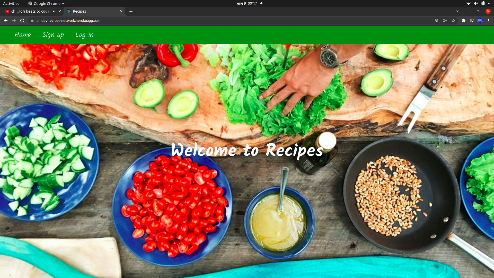

Si quieres utilizar la aplicación puedes acceder en esta url: https://amdev-recipes-network.herokuapp.com/

## Descripción del proyecto

Recipes Network es una red social enfocada a postear recetas de cocina. En ella podemos, a parte de postear nuestras propias recetas, buscar a otros usuarios, seguirlos, ver sus recetas y añadirlas a nuestra lista de favoritas.

## ¿Cómo se utiliza la aplicación?

### Sign up

El primer paso para poder utilizar la aplicación será registrarse con un usuario y contraseña. Los campos del formulario deberán estar correctamente rellenos y la contraseña debe tener una logitud mínima de ocho caracteres.

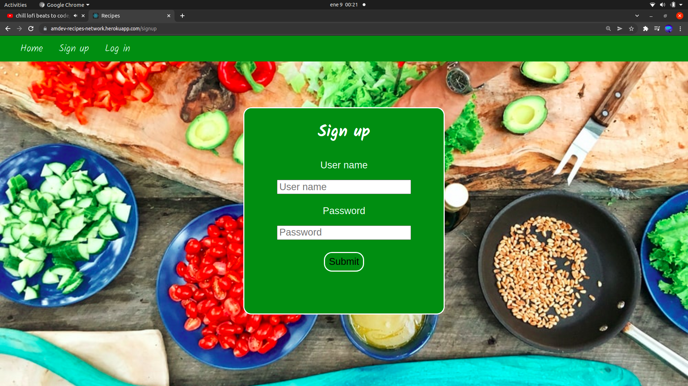

### Log in

Para poder entrar deberemos introducir un usuario registrado con su correspondiente contraseña. En caso de que usuario y contraseña sean correctos, recibiremos un token de autenticación y accederemos a la sesión de manera automática. En caso contrario, se nos mostrará de nuevo el formulario de login pero esta vez con un mensaje de error.

### Inicio de sesión

Esta página nos muestra un mensaje de bienvenida personalizado con el nombre del usuario que se encuentra logueado, un listado con las recetas que hemos posteado hasta el momento y, además, nos da la opción de crear una nueva receta.

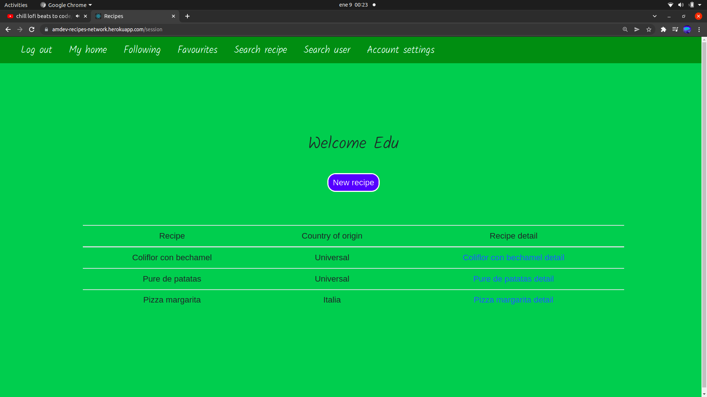

### Nueva receta

Se trata de un formulario que debemos rellenar para postear una nueva receta introduciendo la fecha y la hora de realización de la tarea, el título de la misma y la descripción.

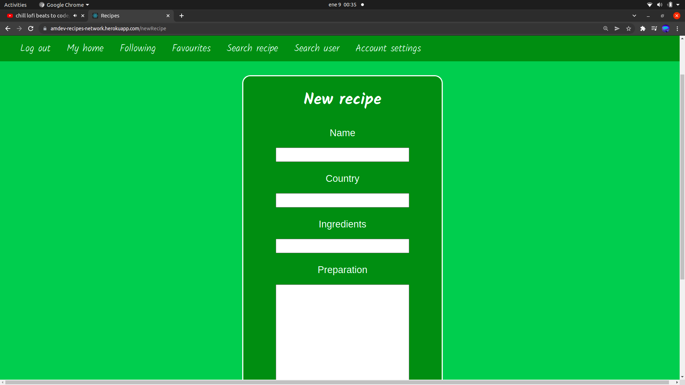

### Detalle de una receta

Tanto si hacemos click en una receta de nuestro listado, como si creamos una nueva o actualizamos una ya posteada, se nos mostrará el detalle de la receta con toda su información.
En este componente se nos muestran dos botones que nos dan la opción de actualizar el contenido de la publicación o de borrar la receta de la aplicación.

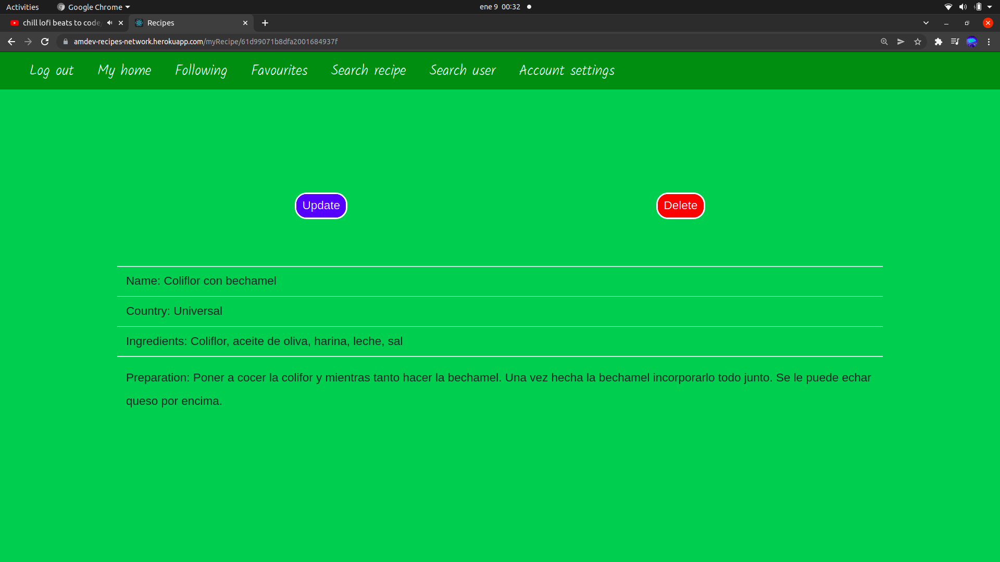

### Actualizar receta

Este formulario es igual que el de creación, con la únida salvedad de que, en este componente, los campos viene rellenos de primeras con la información actual para que nosotros la modifiquemos.

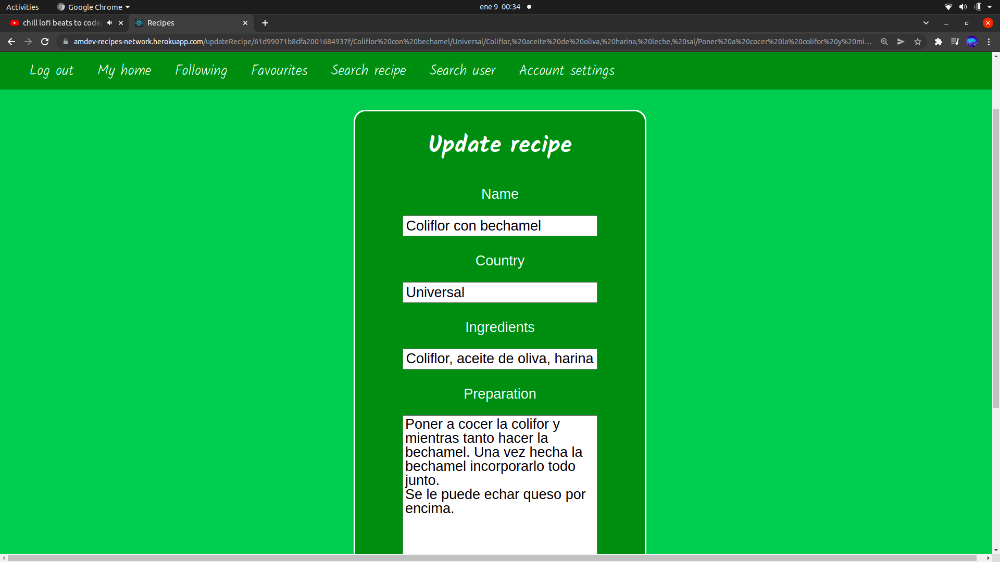

### Borrar receta

Si en el detalle de la receta seleccionamos la opción delete se nos mostrará una pantalla de confirmación en la cual se nos preguntará si queremos borrar la nota definivamente o si queremos volver a la página del detalle.

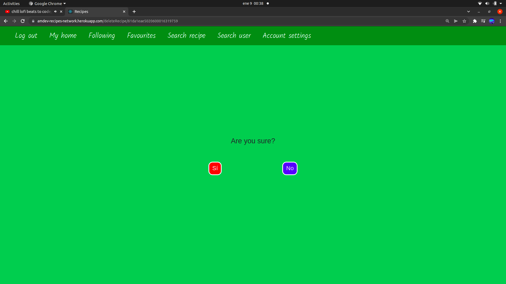

### Buscar a otro usuario

Podemos buscar a otro usuario por su nombre. Vamos a poner un ejemplo buscando a un usuario llamado Juan.

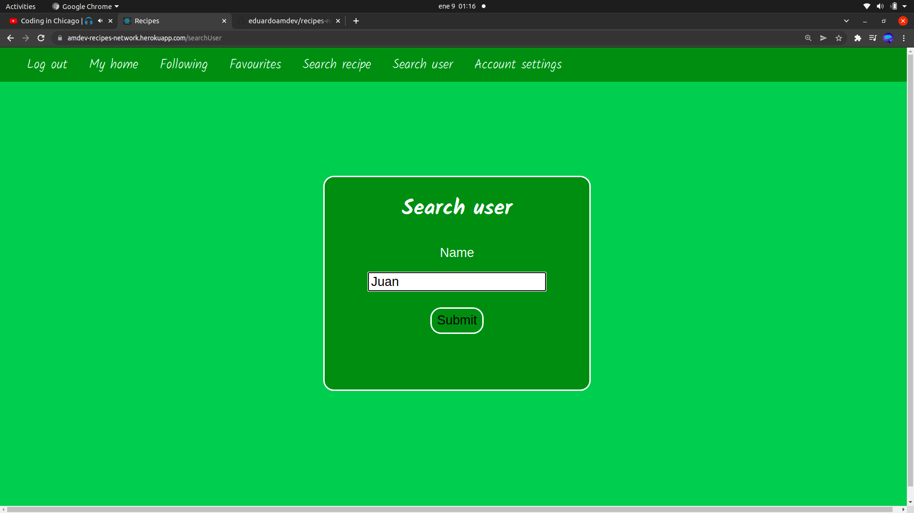

Si el usuario no existe nos mostrará el mismo input con un mensaje de error en la parte inferior. En este caso el usuario sí se encuentra registrado dentro de la aplicación de modo que, se nos va a mostrar un componente con la información del usuario (nombre y listado de sus recetas posteadas) y un símbolo con forma de corazón que nos indica si lo estamos siguiendo o si no. Si el corazón aparece en color rojo significa que ya estamos siguiendo al usuario, en caso contrario lo veremos en gris. En este caso no estamos siguiendo al usuario.

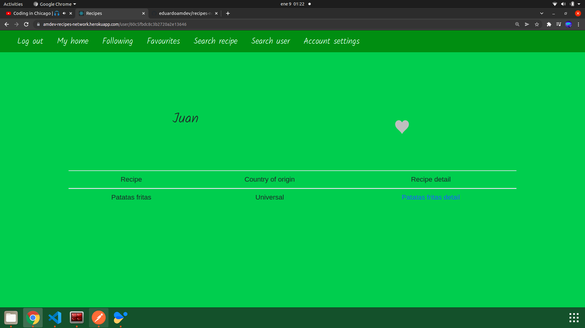

### Seguir a otro usuario

Si, estando en el detalle de un usuario al cual no seguimos, hacemos click en el corazón gris, este cambia a color rojo y, a partir de ese momento ese usuario pasa a estar en nuestra lista de seguidos.

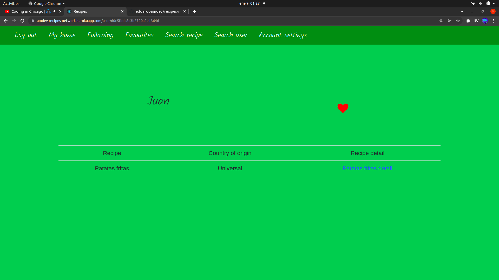

Del mismo modo, si estando en el detalle de un usuario que seguimos, hacemos click en el corazón, este se volvera gris y el usuario dejará de estar en nuestra lista de seguidos.

### Consultar lista de seguidos

Podemos entrar en el apartado "following" para consultar la lista de usuarios que estamos siguiendo.

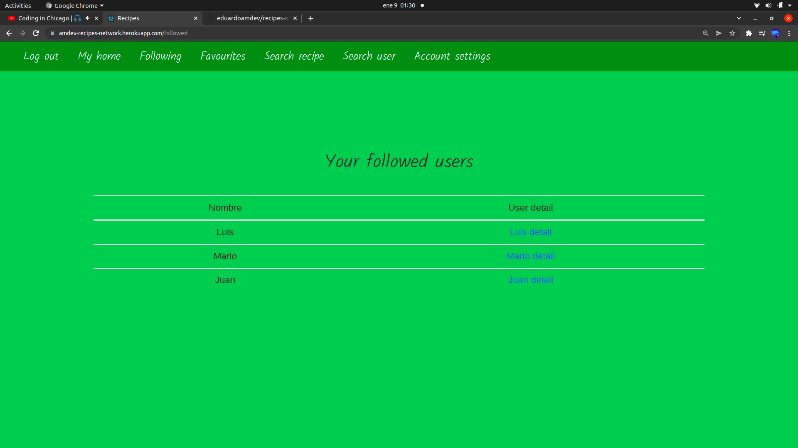

Una vez estemos en la lista podemos ver el detalle de cada usuario.

### Buscar receta

También podemos buscar una receta por su nombre. Vamos a buscar risoto.

Si no encuentra coincidencias en la base detos nos mostrará el mismo input con un mensaje de error en la parte inferior. En este caso sí existe dentro de la base de datos de modo que, se nos va a mostrar un componente con la lista de recetas que tienen el nombre risoto.

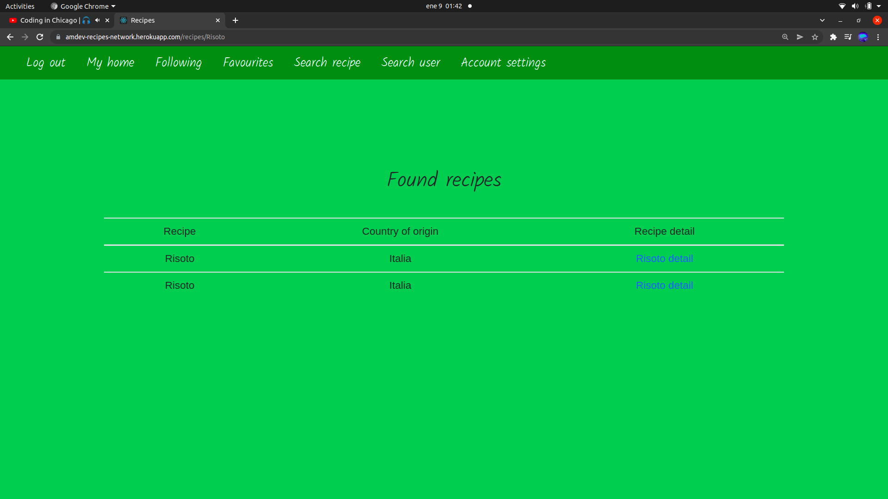

Si entramos en el detalle de cualquiera de las recetas que nos ha devuelto nuestro back-end veremos el nombre, el país, los ingredientes, el proceso de elaboración, el nombre del usuario que la ha posteado y un ícono con forma de estrella que nos indica si la receta se encuentra en nuestra lista de favoritas. Si el ícono aparece transparente con el interior sin colorear (como es el caso) querrá decir que la receta no es una de nuestras favoritas. Si por el contrario el ícono aparece en color amarillo significará que esta receta está en el listado de favoritas.

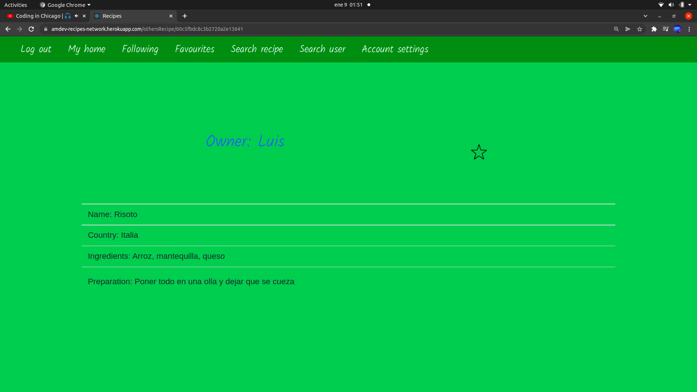

### Agregar receta a favoritas

Si, estando en el detalle de una receta que no es favorita, hacemos click en la estrella tranparente, esta pasa a ser de color amarillo y, a partir de ese momento esa receta pasa a estar en nuestra lista de favoritas.

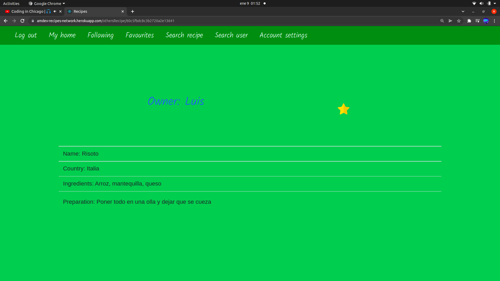

Del mismo modo, si estando en el detalle de una receta favorita, hacemos click en la estrella, esta se volvera transparente y la receta dejará de estar en nuestra lista de favoritas.

### Consultar lista de favoritas

Podemos entrar en el apartado "favorites" para consultar nuestra lista de recetas favoritas.

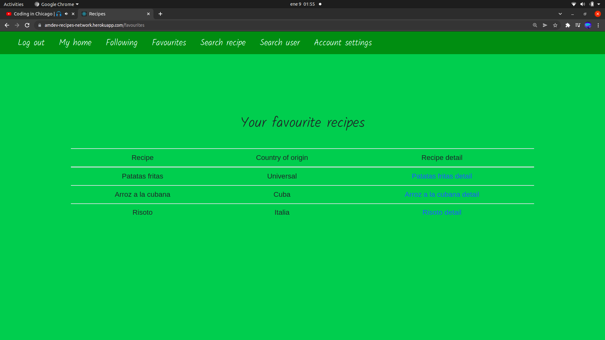

Una vez estemos en la lista podemos ver el detalle de cada receta.

### Ajustes de usuario

En "account settings" podemos acceder a opciones de gestión de cuenta.

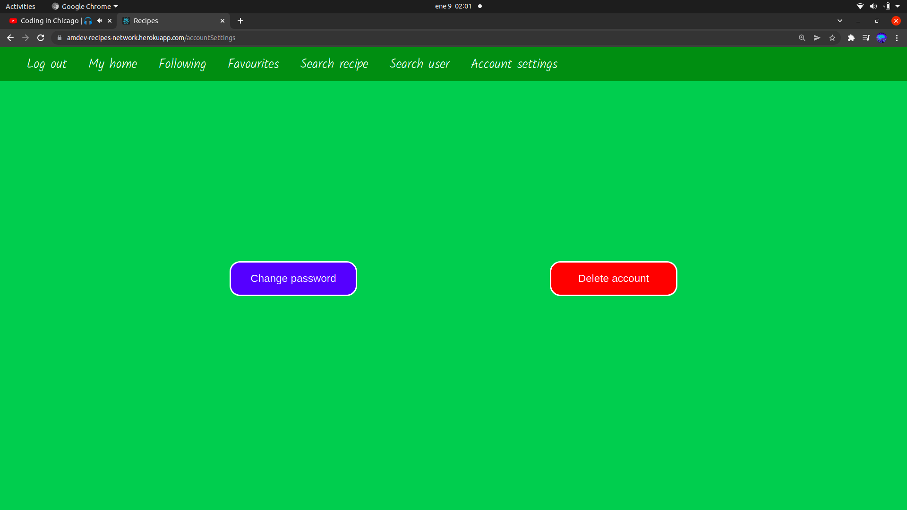

#### Cambiar contraseña

Si seleccionamos la opción "change password" podremos cambiar la contraseña.

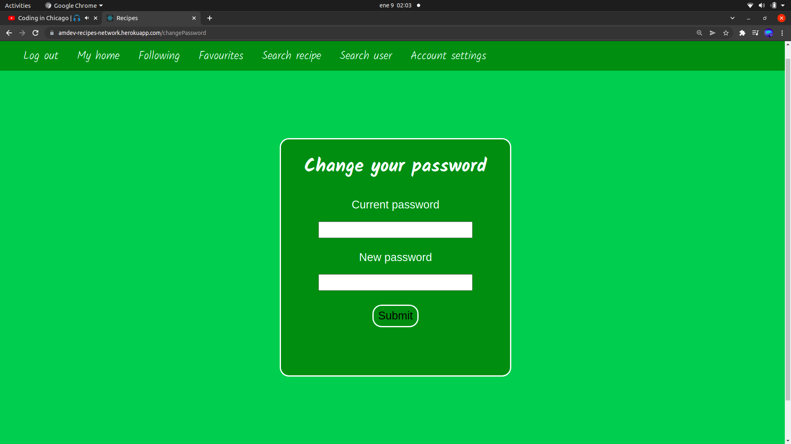

Debermos introducir la contraseña actual y después la nueva.
Una vez cambiada la contraseña nos aparecerá en mismo formulario con un mensaje confirmado que la contraseña ha sido cambiada con éxito. En caso contrario se nos mostrará el correspondiente mensaje de error.

#### Borrar la cuenta

Si seleccionamos "delete account" nos aparecerá una pantalla solicitando confirmación. Si seleccionamos la opción "si" la cuenta se borrará de la aplicación y seremos enviados a la pantalla de registro.

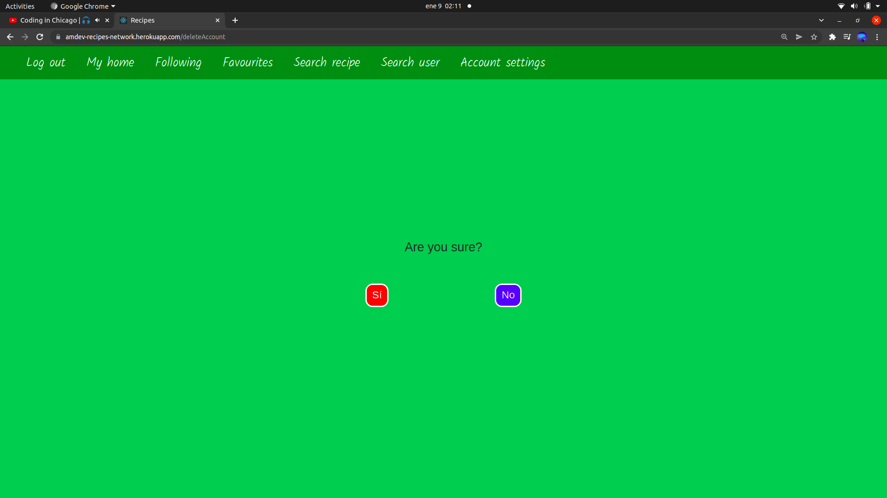

### Logout

En la barra de navegación también encontramos la opción de log out o cierre de sesión. Si hacemos click en ella seremos redirigidos a la página inicial de la aplicación, nuestro token de autenticación será borrado y tendremos que volver a loguearnos para entrar de nuevo a nuestra sesión.

## Tecnologías utilizadas

### `React`

React es una biblioteca de Javascript que sirve para crear interfaces de usuario de una manera sencilla y basándonos en la elaboración de componentes.

### `ReactDOM`

React Dom es el conjunto de bibliotecas de React que nos permiten emplear funcionalidades implementadas específicamente para aplicaciones web.

### `React Router DOM`

Se trata de un conjunto de funcionalidades que nos permiten linkear y enrutar todo nuestro proyecto.
En este proyecto he empleado la versión 6 de este paquete de software.

### `React Scripts`

Nos permite arrancar scripts de manera directa.

### `Bootstrap`

Bootstrap es un framework front-end utilizado para desarrollar aplicaciones web y sitios mobile first, es decir, con un layout que se adapta a la pantalla del dispositivo utilizado por el usuario.

### `React Bootstrap`

React Bootstrap es un conjunto de librerías de Bootstrap diseñadas específicamente para ser utilizadas dentro de un proyecto de React.

## Puesta en marcha

Para arrancar este proyecto de manera local los pasos a seguir son los siguientes:

### `Descargar el repositorio`

Clonaremos el repositorio en nuestro equipo utilizando el comando "git clone" seguido de la url del repositorio.

### `Instalar los paquetes de software`

Una vez clonado el proyecto, accederemos a la raíz del mismo mediante nuestra terminal de comandos para, una vez dentro, ejecutar el comando "npm i".

### `Arrancar el proyecto`

Para arrancar el proyecto debemos ejecutar el comando "npm start".

## Tecnologías empleadas en el lado del back-end

### Express

Express es un paquete de software de NodeJS que nos permite levantar un servidor de manera sencilla.

### Mongoose

Mongoose nos permite interactuar con una base datos MongoDB por medio de los modelos.

### Dotenv

Dotenv nos va a permitir crear un documento con variables de entorno que serán accesibles desde cualquier documento de la API.

### Bcrypt

Este módulo sirve para convertir la contraseña en claro que nos llega del cliente en un hash que podamos guardar en nuestra base de datos.

### JSON Web Token

Con JSON Web Token o JWT crearemos un token de autenticación que enviaremos al usuario después de que este se loguee de manera correcta. Este token quedará almacenado en el navegador y durante la utilización de las funcionalidades de la aplicación nuestro front-end irá haciendo llamadas a la API en las que tendrá que suministrar el token para recibir las respuestas deseadas.

### CORS

El módulo CORS (cross-origin resource sharing) nos permite gestionar qué clientes van a tener acceso la API.

## Puesta en marcha del back-end

Para arrancar esta API de manera local es necesario seguir los siguientes pasos:

### Descargar el repositorio

Hay que clonar el repositorio empleando el comando "git clone" seguido de la url del proyecto.

### Instalar paquetes de software

Acceder a la raíz del proyecto con nuestra terminal y, una vez dentro ejecutar el comando "npm i". De esta manera, instalaremos todos los paquetes de software que figuran en el document package.json de manera local (exclusivamente dentro del directorio del proyecto).

### Base de datos

Es necesario disponer de una base de datos MongoDB para que nuestro servidor de Express se comunique con ella. En este proyecto la url de la base de datos está preparada para trabajar en remoto pero se puede cambiar para trabajar en local.

### Configurar las variables de entorno

Crearemos un archivo .env en el directorio raíz de nuestro proyecto. Este archivo albergará las variables de entorno que son las siguientes:

#### PORT

El puerto de nuestro ordenador en el que queremos que se aloje nuestro back-end.

#### CLUSTER_NAME

El nombre del cluster.

#### DB_NAME

El nombre de la base de datos.

#### DB_PASSWORD

La contraseña de nuestra base de datos.

#### DB_USER

El nombre del usuario de la base de datos.

#### SECRET_WORD

La palabra secreta que emplearemos en JSON Web Token.

### Arrancar el proyecto

El siguiente paso será ejecutar el comando "npm run dev" desde el directorio raíz del proyecto.

### Hacer peticiones

Una vez realizado el proceso de puesta en marcha ya podemos realizar peticiones a la API.
Podemos emplear un cliente web como puede Postman o Insomnia o también tenemos la opción de descargar el front-end de este proyecto y ejecutarlo para que hacer las peticiones mientras ejecutamos la aplicación.
El front-end se puede descargar en el siguiente enlace: https://github.com/eduardoamdev/recipes-network

## ¿Qué me ha aportado el desarrollo de este proyecto?

En este proyecto me he centrado en gestionar correctamente las interacciones entre usuarios ya que, al estar relacionados entre sí, cualquier cambio en un usuario puede afectar a terceros que tengan elementos vinculados a él.
Otro aspecto que he tratado en este proyecto, es el uso de componentes dinámicos, que cumplen una función diferente en función de las props que reciban. Considero que darle dinamismo a los componentes puede hacer que nuestra aplicación funcione de una manera más óptima.

A nivel de back-end la API ha sido la más compleja que he desarrollado hasta la fecha.
La gestión de la contraseñas, autenticacines y sesiones se hace secilla gracias a Bcrypt y JSON Web Token y la comunicación con la base de datos por medio de modelos no supone un problema ya que Mongoose nos facilita enormemente la tarea.
La complejidad ha residido sobre todo en trabajar con las inteacciones entre usuarios, sobre todo a la hora de seguir a otros y de agregar recetas a los favoritos. Para implementar estas funcionalidades ha sido necesario crear los modelos de manera coherente y tenerl en cuenta en diversas rutas los estados de ciertos usuarios con respecto a otros.
Este proyecto también me ha servido para refrescar alguna nociones de testing mediante la utilización de los paquetes Mocha y Chai.